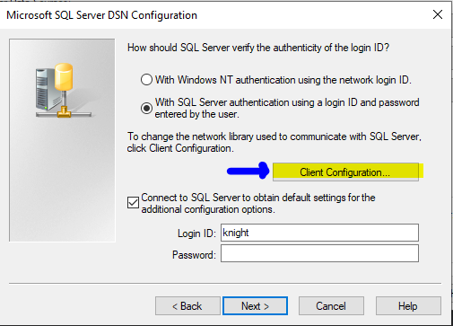
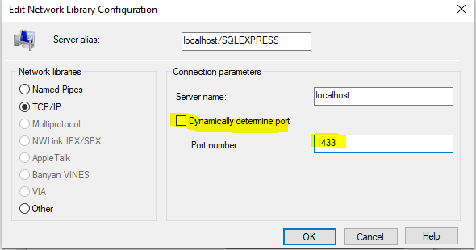

# OpenKO Docker scripts
## Docker Requirements
You must install docker yourself and ensure it is available on the command line (try `docker version` in a terminal.)

Docker isn't for everyone.  It takes time to learn and troubleshoot issues.  if you're uncomfortable with the potential learning curve, you can check our wiki for manual database install instructions.

## Purpose: local development database
These docker services are only meant to be used for local development enviroments.  No precautions have been taken to make any of the containers secure.  DO NOT use this to run a database for a public server - do a manual installation instead.

## Configuration
If you feel compelled to change the default configuration, you may duplicate the file `default.env` and name the new copy `.env`. These files are
in the root project directory (KnightOnline/). This `.env` file is on .gitignore, so you do not need to worry about accidentally
commiting your personal configuration.

## ODBC Tweaks
Standard ODBC configuration is the same, with the exception that you may have to
uncheck "Dynamically assign port" in the pop-up opened from the "Client Configuration..."
button.  You also need to use username/password authentication, as Windows authentication
will not work.

Place your configured port value (default: 1433) here.

## Scripts in this folder
This folder contains several helper scripts to help you create and manage a copy of the OpenKO database using Docker. Depending on your platform, you would want to use the script that ends in `.sh` for linux-based systems, and `.cmd` for Windows.

All of these scripts are meant to be run out of this folder (`KnightOnline/docker`).

* `clean_setup`: Use this for a first-time setup. Removes any existing sqlserver/kodb-util images/volumes, then creates/starts new versions of them. Before the script completes, the script to create an up-to-date OpenKO database will be invoked.
* `reset_database`: Performs a clean import of the OpenKO database.  This will remove any existing OpenKO database instance matching the DB_NAME from the .env file (default: KN_Online), then create a replacement database with the latest data from the OpenKO-db project.
* `stop_containers`: Stops the sqlserver and kodb-util services. 
* `resume_containers`: Resumes the sqlserver and kodb-util services.
* `uninstall`: Removes all sqlserver and kodb-util containers, images, and volumes.